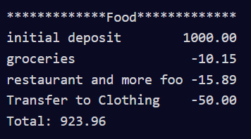
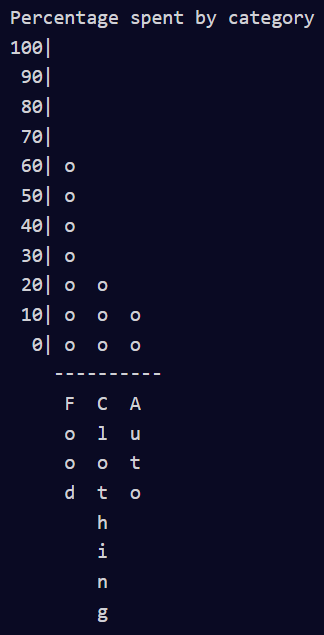

# Py Budget App

* run the test using "py main.py"
* run the budget.py file with "py budget.py"

The instructions for this project can be found [here](https://www.freecodecamp.org/learn/scientific-computing-with-python/scientific-computing-with-python-projects/budget-app), and I have written my own summary below.

The Category class in budget.py instantiates objects based on different categories such as food, clothing, and entertainment.

It has an instance variable called "ledger", which is a list.

It has the following methods:

- **Deposit**: accepts an amount and description and appends an object to the ledger like this: {"amount": amount, "description": description} (if there is no description given, it defaults to an empty string)
- **Withdraw**: similar to deposit, but the amount is stored as a negative number. If there are not enough funds, nothing is added to the ledger. Return "true" if the withdrawal took place, "false" otherwise.
- **Get_balance**: returns the current balance of the Budget category based on the deposits and withdrawals that have occurred
- **Transfer**: accepts an amount and another budget category. Adds a withdrawal with the amount and a description: "Transfer to [destination budget category]". Then adds a deposit to the respective budget category with the amount and a description: "Transfer from [source budget category]". If there are not enough funds, nothing is added to either ledgers. Returns "true" if the transfer took place, "false" otherwise.
- **Check_funds**: accepts an amount. Returns "false" if the amount is greater than the balance of the budget category, and "true" otherwise. This method is used by the **withdraw** and **transfer** methods.

Printing a budget object displays the following (as an example):

- **create_spend_chart** is a function outside the Category class. It takes a list of categories as an argument, and returns a string that is a bar chart.
- The chart shows the percentage spent in each category passed to the **create_spend_chart** function.

Here is an example of the bar chart:

