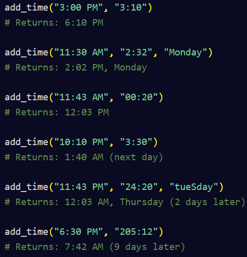

# Time Calculator

This is a [freeCodeCamp project](https://www.freecodecamp.org/learn/scientific-computing-with-python/scientific-computing-with-python-projects/time-calculator). It is a function that takes a start time in 12 h clock format, ending in "AM" or "PM", and adds a duration time that indicates HH:MM to add to the start time, and an optional starting day of the week. The output is the resulting time as well as an indication of the day if the addition spans multiple days.

## Examples:

